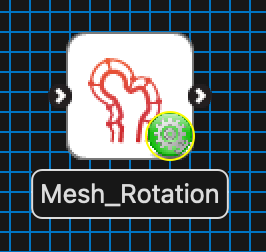
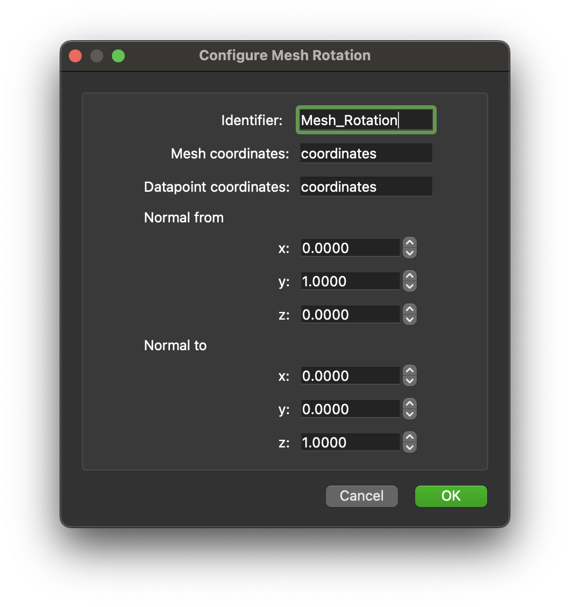

Mesh Rotation
=============

Overview
--------

The **Mesh Rotation** is MAP Client plugin for rotating a mesh using two normals to specify the from plane direction and the to plane direction.

.. _fig-mcp-mesh-rotation-configured-step:

   An configured *Mesh Rotation* step icon.

Specification
-------------

This plugin:

* **uses**:

  * *http://physiomeproject.org/workflow/1.0/rdf-schema#file_location* or *http://physiomeproject.org/workflow/1.0/rdf-schema#exf_file*

* **provides**:

  * *http://physiomeproject.org/workflow/1.0/rdf-schema#file_location* or *http://physiomeproject.org/workflow/1.0/rdf-schema#exf_file*

Configuration
-------------

The configuration interface has interface widgets that can be used to set the following values:

 * Set the step identifier;
 * Set the mesh coordinate field name;
 * Set the datapoint coordinate field name;
 * Set the from plane attributes X, Y, and Z; and
 * Set the to plane attributes X, Y, and Z.

.. _fig-mcp-mesh-rotation-configure-dialog:

   *Mesh Rotation* step configuration dialog.

Instructions
------------

This is a non-interactive step.
See `Configuration`_.
